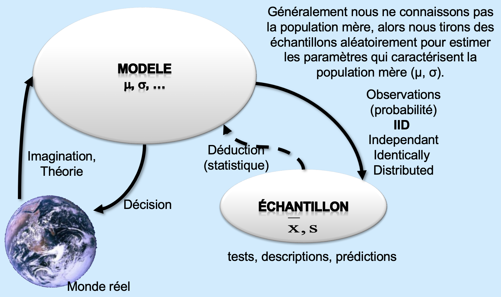
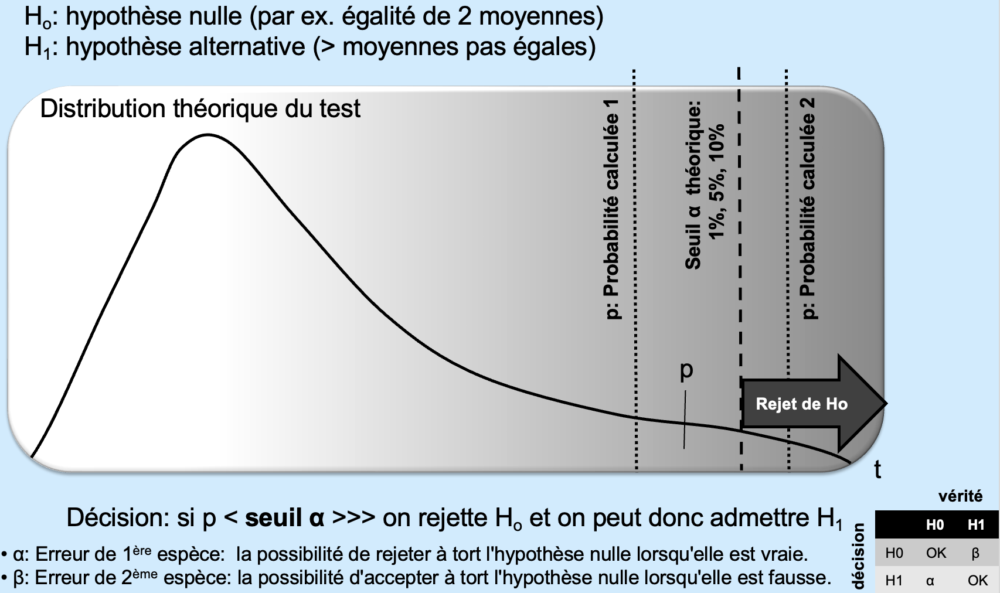
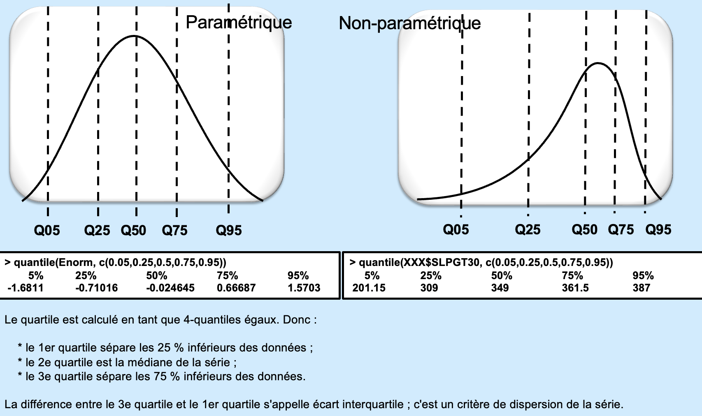
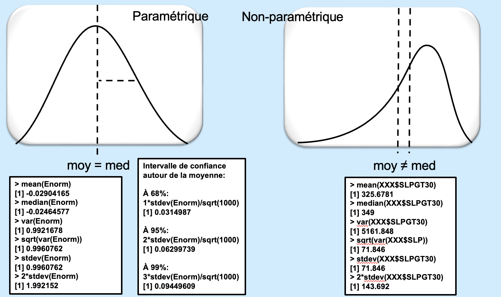
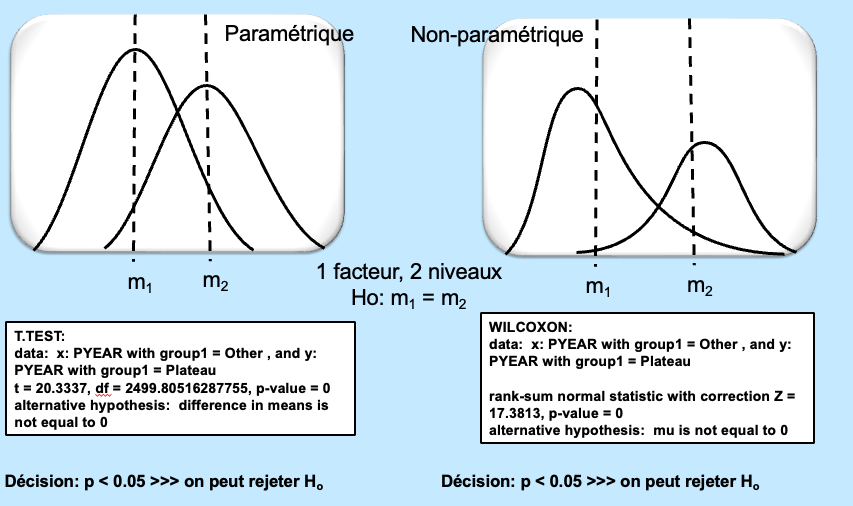
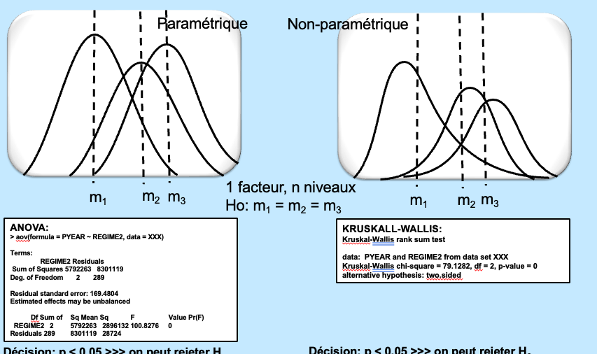
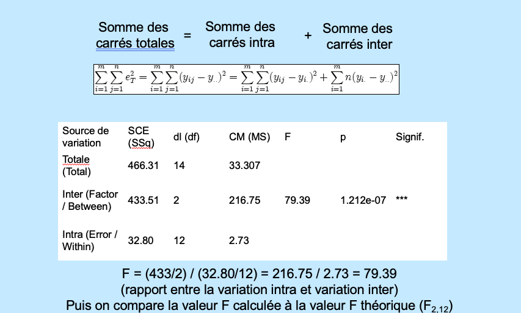

# Objectifs

À la fin de cette séance, vous devriez être capable de :

-   comprendre le principe des tests statistiques ;
-   tester la distribution d'une variable ;
-   savoir choisir le bon test ;
-   exécuter des tests dans **R** (et transposer la démarche dans Python) ;
-   savoir interpréter le résultat des tests.

# Données

## Gapminder data

Gapminder met à disposition de nombreux indicateurs démographiques, économiques, sociaux et environnementaux par pays.

### Vidéo d'introduction

```{=html}
<div style="position:relative;padding-bottom:56.25%;height:0;overflow:hidden;margin-bottom:1rem;">
  <iframe
    src="https://www.youtube-nocookie.com/embed/jbkSRLYSojo"
    title="Gapminder video"
    style="position:absolute;top:0;left:0;width:100%;height:100%;border:0;"
    allow="accelerometer; autoplay; clipboard-write; encrypted-media; gyroscope; picture-in-picture; web-share"
    allowfullscreen>
  </iframe>
</div>
```

### Explorer les données Gapminder

```{=html}
<iframe
  src="https://www.gapminder.org/tools/?embedded=true"
  width="100%"
  height="750"
  style="border:0;"
  allowfullscreen>
</iframe>

<p>
Si la page ne s'affiche pas dans l'iframe,
<a href="https://www.gapminder.org/data/" target="_blank" rel="noopener noreferrer">
ouvrir Gapminder Data dans un nouvel onglet
</a>.
</p>
```

## Charger les données dans R

Le fichier utilisé pour les exercices est :

`data/data 2025.xlsx`

La feuille du classeur s'appelle `data`. Dans le fichier fourni, la population est stockée dans la colonne `pop`.

```{r}
#| label: packages

library(tidyverse)
library(readxl)
library(countrycode)
library(sf)
library(rnaturalearth)

# Si nécessaire, installer une seule fois les packages :
# install.packages(c(
#   "tidyverse", "readxl", "countrycode",
#   "sf", "rnaturalearth", "rnaturalearthdata"
# ))
```

```{r}
#| label: import-data

data_path <- "data/data 2025.xlsx"

data_2025 <- read_excel(
  data_path,
  sheet = "clean"
)


summary(data_2025)
```

Le fichier contient les variables suivantes :

```{r}
#| label: variables-data

names(data_2025)
```

### Calculer la densité de population

```{r}
#| label: prepare-area-density


data_2025$denspop = data_2025$pop / data_2025$area_km2


data_2025 |>
  select(geo, name, region, pop, area_km2, denspop) |>
  head()
```

Vérifions les quatre régions et les éventuels pays sans superficie associée :

```{r}
#| label: check-regions-area

data_2025 |>
  count(region, sort = TRUE)

data_2025 |>
  filter(is.na(area_km2)) |>
  select(geo, name, region)

data_2025 = data_2025[!is.na(data_2025$area_km2),]
data_2025 = data_2025[data_2025$area_km2>1000,]
```

# Théories et exemples

## Échantillons aléatoires

Un **échantillon aléatoire** est un sous-ensemble d'observations sélectionnées de manière telle que chaque observation ait une chance connue d'être sélectionnée. L'échantillonnage aléatoire réduit le risque de biais de sélection et constitue une base importante de l'inférence statistique.



### Tirer aléatoirement des valeurs de `pop`

Nous tirons ici 50 pays au hasard parmi ceux pour lesquels la population est renseignée.

```{r}
#| label: random-pop-sample

set.seed(123)

echantillon_pop <- data_2025 |>
  filter(!is.na(pop)) |>
  slice_sample(n = 50)

echantillon_pop |>
  select(name, region, pop) |>
  head(10)
```

### Histogramme de l'échantillon

```{r}
#| label: histogram-random-pop
#| fig-cap: "Distribution de la population dans un échantillon aléatoire de 50 pays."

ggplot(echantillon_pop, aes(x = pop)) +
  geom_histogram(bins = 15) +
  labs(
    x = "Population",
    y = "Nombre de pays",
    title = "Échantillon aléatoire de la population"
  ) +
  theme_minimal()
```

La population des pays est généralement très asymétrique. Une transformation logarithmique peut être utile pour la visualisation :

```{r}
#| label: histogram-random-pop-log
#| fig-cap: "Même échantillon avec une échelle logarithmique pour la population."

ggplot(echantillon_pop, aes(x = pop)) +
  geom_histogram(bins = 15) +
  scale_x_log10() +
  labs(
    x = "Population — échelle logarithmique",
    y = "Nombre de pays",
    title = "Population de l'échantillon en échelle logarithmique"
  ) +
  theme_minimal()
```

Nous pouvons améliorer le thème pour tous les graphiques

```{r}
theme_stats <- theme_minimal(base_size = 14) +
  theme(
    plot.title = element_text(face = "bold", size = 16),
    plot.subtitle = element_text(size = 12),
    axis.title = element_text(face = "bold"),
    strip.text = element_text(face = "bold"),
    panel.grid.minor = element_blank(),
    legend.position = "bottom"
  )
```

```{r}
ggplot(data_2025, aes(x = pop)) +
  geom_histogram(
    bins = 30,
    fill = "steelblue",
    colour = "white",
    linewidth = 0.4
  ) +
  labs(
    title = "Distribution de la population",
    subtitle = "Ensemble des pays du jeu de données",
    x = "Population",
    y = "Nombre de pays"
  ) +
  theme_stats
```

## Principes des tests

Un test statistique part généralement de deux hypothèses :

-   **H0**, l'hypothèse nulle : absence d'effet, de différence ou d'écart à une distribution de référence ;
-   **H1**, l'hypothèse alternative : présence d'un effet, d'une différence ou d'un écart.

La **p-value** représente la probabilité d'obtenir un résultat au moins aussi extrême que celui observé si H0 est vraie.

Avec un seuil usuel de (alpha = 0,05) :

-   si `p < 0.05`, on rejette H0 ;
-   si `p >= 0.05`, on ne dispose pas d'éléments suffisants pour rejeter H0.

> Ne pas rejeter H0 ne signifie pas que H0 est démontrée vraie.
>
> 

### Exemple 1 — échantillon issu d'une distribution normale

Nous générons 50 observations d'une loi normale standard, visualisons leur distribution et appliquons le test de **Shapiro-Wilk**.

Pour ce test :

-   H0 : les données sont compatibles avec une distribution normale ;
-   H1 : les données ne sont pas compatibles avec une distribution normale.

```{r}
#| label: normal-sample

set.seed(123)

echantillon_normal <- rnorm(
  n = 50,
  mean = 0,
  sd = 1
)

tibble(x = echantillon_normal) |>
  ggplot(aes(x = x)) +
  geom_histogram(bins = 12, fill = "steelblue", colour = "white", linewidth = 0.4) +
  labs(
    title = "Échantillon de 50 valeurs — loi normale",
    x = "Valeur",
    y = "Effectif"
  ) +
  theme_stats

shapiro.test(echantillon_normal)
```

### Exemple 2 — échantillon issu d'une distribution uniforme

```{r}
#| label: uniform-sample

set.seed(123)

echantillon_uniforme <- runif(
  n = 50,
  min = 0,
  max = 1
)

tibble(x = echantillon_uniforme) |>
  ggplot(aes(x = x)) +
  geom_histogram(bins = 12, fill = "steelblue", colour = "white", linewidth = 0.4) +
  labs(
    title = "Échantillon de 50 valeurs — loi uniforme",
    x = "Valeur",
    y = "Effectif"
  ) +
  theme_minimal()

shapiro.test(echantillon_uniforme)
```

**Attention :** avec seulement 50 observations, un test de normalité peut parfois ne pas détecter un écart à la normalité. Il faut donc interpréter le test conjointement avec les graphiques.

### Exemple 3 — tester la normalité de `gdp`

```{r}
#| label: shapiro-gdp

gdp_complete <- data_2025 |>
  filter(!is.na(gdp_pcap)) |>
  pull(gdp_pcap)

shapiro.test(gdp_complete)
```

Visualisons également les données :

```{r}
#| label: histogram-pop-normality

ggplot(data_2025, aes(x = gdp_pcap)) +
  geom_histogram(bins = 30, na.rm = TRUE, fill = "steelblue", colour = "white", linewidth = 0.4) +
  labs(
    title = "Distribution du GDP par capita des pays",
    x = "GDP per capita",
    y = "Nombre de pays"
  ) +
  theme_minimal()
```

### Exemple 4 — tester la normalité de `lex`

```{r}
#| label: shapiro-lex

lex_complete <- data_2025 |>
  filter(!is.na(lex)) |>
  pull(lex)

shapiro.test(lex_complete)
```

Visualisons également les données :

```{r}
#| label: histogram-lex-normality

ggplot(data_2025, aes(x = lex)) +
  geom_histogram(bins = 30, na.rm = TRUE, fill = "steelblue", colour = "white", linewidth = 0.4) +
  labs(
    title = "Distribution du Life Expectency des pays",
    x = "Life expectency",
    y = "Nombre de pays"
  ) +
  theme_minimal()
```

## Paramétrique ou pas ?

Les tests **paramétriques** utilisent des hypothèses sur la distribution des données ou des résidus, souvent la normalité. Ils sont généralement puissants lorsque leurs hypothèses sont raisonnablement satisfaites.

Les tests **non paramétriques** reposent sur moins d'hypothèses distributionnelles et sont souvent basés sur les rangs.

| Question                        | Paramétrique      | Non paramétrique      |
|---------------------------------|-------------------|-----------------------|
| Comparer 2 groupes indépendants | test t de Student | Wilcoxon–Mann-Whitney |
| Comparer plus de 2 groupes      | ANOVA             | Kruskal-Wallis        |
| Tester la normalité             | Shapiro-Wilk      | —                     |

La décision ne doit pas reposer uniquement sur un test de normalité. Il faut aussi examiner les histogrammes, les valeurs extrêmes, la taille des échantillons et les hypothèses propres au test envisagé.





### Tester la normalité de toutes les variables quantitatives

```{r}
#| label: normality-all-numeric

variables_quantitatives <- data_2025 |>
  select(where(is.numeric)) |>
  names()

resultats_normalite <- map_dfr(
  variables_quantitatives,
  function(variable) {

    x <- data_2025[[variable]]
    x <- x[is.finite(x)]

    if (length(x) >= 3 &&
        length(x) <= 5000 &&
        length(unique(x)) >= 3) {

      test <- shapiro.test(x)

      tibble(
        variable = variable,
        n = length(x),
        W = unname(test$statistic),
        p_value = test$p.value,
        conclusion = if_else(
          test$p.value < 0.05,
          "Rejet de la normalité",
          "Normalité non rejetée"
        )
      )

    } else {

      tibble(
        variable = variable,
        n = length(x),
        W = NA_real_,
        p_value = NA_real_,
        conclusion = "Test non applicable"
      )
    }
  }
)

resultats_normalite
```

### Histogrammes de toutes les variables quantitatives

```{r}
#| label: histograms-all-numeric
#| fig-width: 11
#| fig-height: 8

data_2025 |>
  pivot_longer(
    cols = where(is.numeric),
    names_to = "variable",
    values_to = "valeur"
  ) |>
  filter(is.finite(valeur)) |>
  ggplot(aes(x = valeur)) +
  geom_histogram(bins = 20, fill = "steelblue", colour = "white", linewidth = 0.1) +
  facet_wrap(
    ~ variable,
    scales = "free"
  ) +
  labs(
    title = "Distribution des variables quantitatives",
    x = NULL,
    y = "Effectif"
  ) +
  theme_minimal()
```

## Comparaison de 2 moyennes



Nous comparons ici **l'Europe** et **l'Afrique**.

### Life expectency des pays d'Europe et d'Afrique

```{r}
#| label: hist-lex-europe-africa
#| fig-width: 9
#| fig-height: 4.5

europe_afrique <- data_2025 |>
  filter(region %in% c("europe", "africa"))

ggplot(
  europe_afrique,
  aes(x = lex)
) +
  geom_histogram(bins = 20, na.rm = TRUE, fill = "steelblue", colour = "white", linewidth = 0.4) +
  facet_wrap(
    ~ region,
    scales = "free_y"
  ) +
  labs(
    title = "Life Expectency des pays d'Europe et d'Afrique",
    x = "Life expectency",
    y = "Nombre de pays"
  ) +
  theme_minimal()


ggplot(
  europe_afrique,
  aes(x = region, y = lex, fill = region)
) +
  geom_boxplot(
    width = 0.55,
    alpha = 0.65,
    outlier.shape = NA
  ) +
  geom_jitter(
    width = 0.12,
    size = 2,
    alpha = 0.6
  ) +
  labs(
    title = "Life expectency",
    subtitle = "Chaque point représente un pays",
    x = NULL,
    y = "Years"
  ) +
  guides(fill = "none") +
  theme_stats

```

### Test t de Student

Nous comparons la moyenne des deux groupes.

Hypothèses :

-   H0 : la lex est identique en Europe et en Afrique ;
-   H1 : les lex moyens diffèrent.

La version classique du test de Student suppose notamment l'indépendance, une normalité raisonnable au sein des groupes et l'égalité des variances. Ici, `var.equal = TRUE` demande explicitement la version classique de Student.

```{r}
#| label: student-europe-africa

test_student <- t.test(
  lex ~ region,
  data = europe_afrique,
  var.equal = TRUE
)

test_student
```

### Test de Wilcoxon–Mann-Whitney

Ce test non paramétrique compare les rangs des observations des deux groupes. Il ne nécessite pas l'hypothèse de normalité.

```{r}
#| label: wilcoxon-europe-africa

test_wilcoxon <- wilcox.test(
  lex ~ region,
  data = europe_afrique,
  exact = FALSE
)

test_wilcoxon
```

> Le test de Wilcoxon–Mann-Whitney est souvent présenté comme une comparaison des distributions. Plus précisément, il teste un décalage dans les rangs ; son interprétation comme comparaison de médianes suppose notamment des distributions de forme comparable.

## Comparaison de plus de 2 moyennes



Nous étendons maintenant la comparaison aux **quatre continents** présents dans les données.

```{r}
#| label: four-regions

four_regions <- data_2025 |>
  filter(
    !is.na(region),
    region %in% c(
      "africa",
      "americas",
      "asia",
      "europe"
    )
  )

four_regions |>
  count(region)
```

### Population des quatre régions

```{r}
#| label: hist-lex-four-regions
#| fig-width: 10
#| fig-height: 7


ggplot(four_regions, aes(x = lex, fill = region)) +
  geom_histogram(
    bins = 20,
    colour = "white",
    alpha = 0.85
  ) +
  facet_wrap(
    ~ region,
    scales = "free_y"
  ) +
  scale_x_log10(
    labels = scales::label_number(big.mark = " ")
  ) +
  labs(
    title = "Distribution de la population",
    subtitle = "Comparaison entre les quatre continents",
    x = "LEX",
    y = "Nombre de pays"
  ) +
  guides(fill = "none") +
  theme_stats


ggplot(
  four_regions,
  aes(
    x = region,
    y = lex,
    fill = region
  )
) +
  geom_boxplot(
    width = 0.65,
    alpha = 0.7,
    outlier.shape = NA
  ) +
  geom_jitter(
    width = 0.15,
    alpha = 0.5,
    size = 1.8
  ) +
  labs(
    title = "LEX par région",
    subtitle = "Comparaison des quatre continents",
    x = NULL,
    y = "Years"
  ) +
  guides(fill = "none") +
  theme_stats
```

### ANOVA



L'ANOVA teste si toutes les moyennes peuvent être considérées comme identiques.

-   H0 : les quatres régions ont la même life expectency ;
-   H1 : au moins une moyenne diffère.

```{r}
#| label: anova-lex

modele_anova <- aov(
  lex ~ region,
  data = four_regions
)

summary(modele_anova)
```

Une ANOVA significative indique qu'au moins une moyenne diffère, mais ne précise pas laquelle. Un test post-hoc de Tukey permet d'explorer les différences deux à deux :

```{r}
#| label: tukey-posthoc

TukeyHSD(modele_anova)
```

### Diagnostic des résidus de l'ANOVA

L'hypothèse de normalité porte surtout sur les **résidus du modèle**, et non nécessairement sur la variable brute.

```{r}
#| label: anova-diagnostics
#| fig-width: 8
#| fig-height: 5

residus_anova <- residuals(modele_anova)

shapiro.test(residus_anova)

tibble(residus = residus_anova) |>
  ggplot(aes(x = residus)) +
  geom_histogram(bins = 20, na.rm = TRUE, fill = "steelblue", colour = "white", linewidth = 0.4) +
  labs(
    title = "Distribution des résidus de l'ANOVA",
    x = "Résidus",
    y = "Effectif"
  ) +
  theme_stats
```

### Test de Kruskal-Wallis

Le test de Kruskal-Wallis est l'alternative non paramétrique à l'ANOVA à un facteur.

-   H0 : les groupes ont des distributions de rangs comparables ;
-   H1 : au moins un groupe diffère.

```{r}
#| label: kruskal-wallis-density

test_kruskal <- kruskal.test(
  lex ~ region,
  data = four_regions
)

test_kruskal
```

# Interprétation générale

Pour interpréter un test statistique, on peut suivre quatre étapes :

1.  **Formuler H0 et H1** avant de regarder le résultat.
2.  **Vérifier les hypothèses** du test et examiner graphiquement les données.
3.  **Lire la p-value** en la comparant au seuil (\alpha), souvent fixé à 0,05.
4.  **Interpréter l'effet dans son contexte**, sans limiter la conclusion à « significatif » ou « non significatif ».

La significativité statistique ne renseigne pas à elle seule sur l'importance pratique d'une différence. Il est également utile d'examiner les moyennes ou médianes, la dispersion, les tailles d'effet et les intervalles de confiance.

# Résumé : quel test choisir ?

| Objectif | Nombre de groupes | Conditions principales | Test |
|----|---:|----|----|
| Tester la normalité | 1 variable | données quantitatives | Shapiro-Wilk |
| Comparer des moyennes | 2 | hypothèses paramétriques raisonnables | Student / Welch |
| Comparer des rangs | 2 | approche non paramétrique | Wilcoxon–Mann-Whitney |
| Comparer des moyennes | \> 2 | hypothèses paramétriques raisonnables | ANOVA |
| Comparer des rangs | \> 2 | approche non paramétrique | Kruskal-Wallis |
